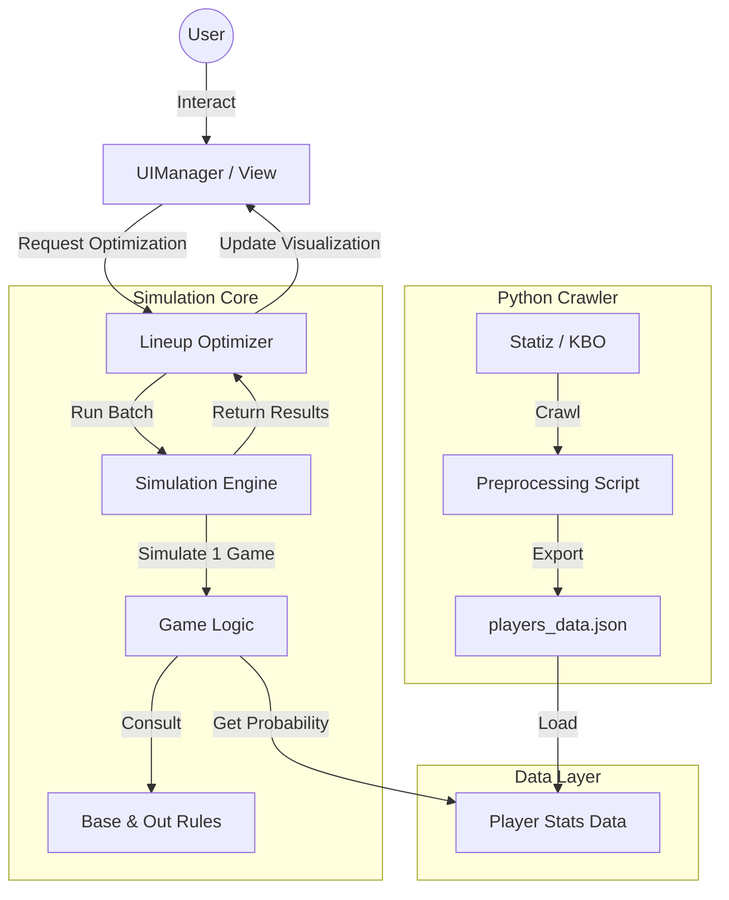

# 🦅 Hanwha Eagles Lineup Optimizer (한화 이글스 라인업 최적화 실험)


> **"데이터로 증명하는 최강의 라인업"**
>
> 몬테카를로 시뮬레이션을 통해 타순 변경에 따른 기대 득점(Expected Runs)과 승리 확률 변화를 예측하는 웹 애플리케이션입니다.

---

## 📖 프로젝트 소개 (Introduction)

야구에서 "타순(Lineup)"은 경기의 흐름을 바꾸는 결정적인 요소입니다. 하지만 많은 경우, 라인업 결정은 감독의 직관이나 단순한 과거 기록에 의존하곤 합니다.

**"만약 1번 타자와 4번 타자의 순서를 바꾸면 득점이 얼마나 늘어날까?"**

이 프로젝트는 이러한 호기심에서 출발했습니다. 공학적인 접근(시뮬레이션)을 통해 야구 데이터를 분석하고, 가장 높은 기대 승률을 보장하는 최적의 라인업을 제안합니다. 한화 이글스 팬으로서의 열정과 소프트웨어 엔지니어로서의 문제 해결 능력을 결합하여, **데이터 기반의 의사결정 시스템(Data-Driven Decision Support System)**을 직접 구현했습니다.

## ✨ 핵심 기능 (Key Features)

-   **⚾ 정교한 시뮬레이션 엔진**: 선수별 세부 스탯과 주자 상황별 전이 확률(Context-Aware Transition)을 반영한 고도화된 몬테카를로/마르코프 모델. 구장 효과(Park Factor)까지 보정 가능.
-   **🧬 유전 알고리즘 (Genetic Algorithm)**: 36만 가지 조합 중 단순 무작위가 아닌, 진화 연산을 통해 '최적의 DNA'를 가진 라인업을 2초 내에 고속 탐색.
-   **🔄 실시간 대타 시뮬레이터 (Live Sub)**: "7회말 1사 1,2루, 대타 문현빈 투입 시 승률 변화는?" 코칭 스태프의 작전을 실시간 검증.
-   **📈 인터랙티브 데이터 시각화**: 복잡한 통계 데이터를 한눈에 파악할 수 있도록 직관적인 승률 그래프와 필드 뷰 대시보드를 제공합니다.
-   **📱 반응형 웹 디자인**: Tailwind CSS를 활용하여 모바일과 데스크톱 환경 모두에서 최적의 사용자 경험을 제공합니다.

## 💡 기술적 챌린지 & 우수성 (Highlights)

이 프로젝트는 단순한 구현을 넘어, **견고한 소프트웨어 아키텍처**와 **엔지니어링 원칙**을 준수하며 개발되었습니다.

### 1. Pure JavaScript & OOP 설계
외부 프레임워크(React, Vue 등)에 의존하지 않고, **Vanilla JavaScript**와 **ES6 Module** 시스템만을 사용하여 SPA(Single Page Application)를 구축했습니다. 이를 통해 브라우저의 동작 원리를 깊이 있게 이해하고, 가볍고 빠른 애플리케이션을 만들었습니다.

### 2. TDD (Test-Driven Development) 기반의 신뢰성 확보
시뮬레이션 결과의 정확성은 이 프로젝트의 생명입니다.
-   `SimulationEngine`, `Optimizer` 등 핵심 로직 개발 전 과정에 **TDD**를 적용했습니다.
-   **Jest**를 활용하여 단위 테스트(Unit Test)를 작성하고, 다양한 경기 상황(만루, 병살타, 희생타 등)에 대한 엣지 케이스를 검증했습니다.

### 3. SOLID 원칙을 따르는 모듈형 아키텍처
유지보수성과 확장성을 고려하여 **SOLID 원칙**을 코드에 녹여냈습니다.
-   **SRP**: 시뮬레이션 로직과 UI 렌더링 로직을 철저히 분리했습니다.
-   **DIP**: 데이터 소스나 난수 생성기를 외부에서 주입받도록 설계하여 테스트 용이성을 높였습니다.

### 4. 데이터 중심 설계 (Data-Driven Strategy)
신뢰성 높은 시뮬레이션을 위해 체계적인 데이터 파이프라인을 구축했습니다.
-   **Collection**: Python(BeautifulSoup) 크롤러를 통해 Statiz 등에서 최신 선수 데이터를 수집.
-   **Preprocessing**: 수집된 데이터를 마르코프 체인 전이 확률로 변환하여 정규화.
-   **Integration**: 전처리된 JSON 데이터를 프론트엔드 엔진에 주입하여 시뮬레이션 수행.

## 🏗️ 시스템 아키텍처 (Architecture)

이 프로젝트는 **MVC (Model-View-Controller)** 패턴을 변형한 구조를 따르며, 데이터 흐름과 책임의 분리가 명확합니다.



-   **UIManager**: 사용자의 입력을 처리하고 DOM을 업데이트합니다.
-   **Optimizer**: 다양한 라인업 조합을 생성하고 시뮬레이션 엔진을 제어하는 '전략가' 역할을 합니다.
-   **Simulation Engine**: 실제 경기를 가상으로 수행하는 로직이 담겨 있으며, 외부의 간섭 없이 순수한 확률 게임을 진행합니다.

## 🚀 시작하기 (How to Run)

이 프로젝트는 별도의 빌드 과정 없이 정적 파일만으로 실행 가능합니다.

```bash
# 1. 저장소 클론
git clone https://github.com/YOUR_USERNAME/hanwhalinup.git

# 2. 프로젝트 디렉토리 이동
cd hanwhalinup

# 3. 의존성 설치 (테스트 실행용)
npm install

### 3. Data Pipeline Setup (Issue #9)
To update player data from Python crawler:
```bash
cd data_pipeline
# (Optional) pip install pandas requests beautifulsoup4
python crawl_and_process.py
```
This will regenerate `src/data/roster.js`.

## 4. Testing
npm test

# 5. 실행 (로컬 서버 권장)
npx live-server .
```

## 👨‍💻 만든 사람 (Author)

**[당신의 이름]** - Passionate Software Engineer
*   Github: [@YourUsername](https://github.com/YourUsername)
*   Email: your.email@example.com

> "야구를 사랑하는 마음으로, 코드로 승리를 설계합니다."
